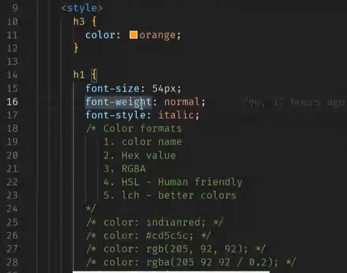

# Anchor tag

-> anchor tag is not only used for links it is also used for phone numbers(dailer), watsapp
for telephone tel:

# internal or embedded css

- style tag is being added in the head tag

- if we use internal css, then time for page loading is less when compared to when keeping style in the external css

# use of external css

- code reusability , we can use the css file name in different html pages.

# hierarchy of applying css on same element - specificity

# color value

# hsl

- hue is the color ex: white, black;
- saturation - intensity of color
- lightness - if we increase the value then white will be more and if va;ue is less then black

# rgba

r- red
g-green
b - blue
a - alpha value refers to the transparency.

# when do we prefer external css

- we can use the same css file for different html pages
- separate file concern

# color gamet

- srgb
- dcpi

# serif

- used by the companies which needs to represent secure and traditional ex: banks.

# san serif

- modern

-> default font family in android is roboto

# Box model

- margin -> border -> padding -> content.

- padding
  -> is the space between border and content

# margin

- when u want to have space between elements.

# border radius

- when increasing the pixel then border will bend

# max-width:600px;

- when we compress the screen the lines of paragraph will go to next line.

# styles

1 vh = 1 percent of screen height  
1 vm = 1 percent of screen width

# elements that cannot be inherited from parent :

- padding
- height
- width
- border
- list

# element having default margin inside padding

- list

# object-fit : cover

- it displays the image nicely, by accomodationg with in the container

# difference between span and div

# for combining two colors use mycolors.space website

# anchor tags are by default inline, because it accomodate the width how much it is needed

# paragraph tags are by default block level, it takes the whole level width.

# span is an inline element div is an block level element
