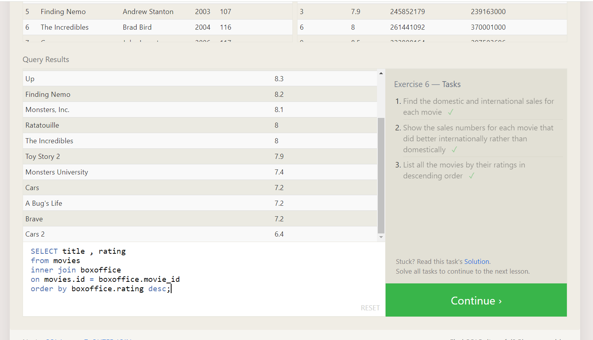
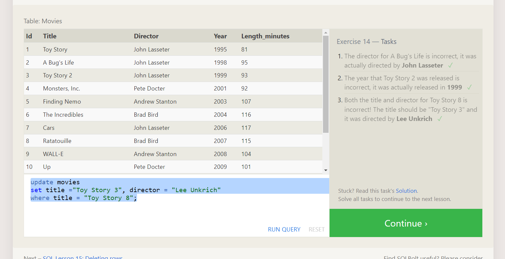

# SQL, or Structured Query Language, is for relational databases

# where clause


# SELECT DISTINCT column, another_column,

- here the distinct keyword applys to both the columns.

# ORDER BY clause is specified, each row is sorted alpha-numerically

# The LIMIT will reduce the number of rows to return, and the optional OFFSET will specify where to begin counting the number rows from.

# about offset

- In Oracle, passing a negative value to the OFFSET clause results in the offset being treated as 0, effectively skipping no rows. For example, SELECT _ FROM table OFFSET -3 is equivalent to SELECT _ FROM table OFFSET 0.

1. Find the title of each film

```sql
SELECT title from movies;

```

2. Find the director of each film

```sql

SELECT director from movies;

```

3. Find the title and director of each film

```sql
SELECT title, director from movies;

```

4. Find the title and year of each film

```sql
SELECT title , year from movies;

```

5. Find all the information about each film

```sql
SELECT * from movies;

```

BETWEEN … AND … Number is within range of two values (inclusive) col_name BETWEEN 1.5 AND 10.5
NOT BETWEEN … AND … Number is not within range of two values (inclusive) col_name NOT BETWEEN 1 AND 10

1. Find the movie with a row id of 6

```sql
SELECT *
FROM movies
where id =6;
```

2. Find the movies released in the years between 2000 and 2010

```sql
SELECT *
FROM movies
where year BETWEEN 2000 AND 2010;
```

3. Find the movies not released in the years between 2000 and 2010

```sql
SELECT *
FROM movies
where year   NOT BETWEEN 2000 AND 2010;
```

4. Find the first 5 Pixar movies and their release year

```sql
SELECT title , year
FROM movies
where id <=5;
```


# = Case sensitive exact string comparison (notice the single equals) col_name = "abc"

# LIKE Case insensitive exact string comparison col_name LIKE "ABC"

Exercise 3 — Tasks

1. Find all the Toy Story movies

```sql
SELECT title from movies
where title like "%Toy Story%";
```

2. Find all the movies directed by John Lasseter

```sql
SELECT title from movies
where director = "John Lasseter";
```

3. Find all the movies (and director) not directed by John Lasseter

```sql SELECT title,director from movies
where director != "John Lasseter";
```

4. Find all the WALL-\* movies

```sql
SELECT title from movies
where title like "WALL%";
```


# The LIMIT will reduce the number of rows to return, and the optional OFFSET will specify where to begin counting the number rows from.

Exercise 4 — Tasks

1. List all directors of Pixar movies (alphabetically), without duplicates

```sql
SELECT  DISTINCT director
from movies
order by director ASC;
```

2. List the last four Pixar movies released (ordered from most recent to least)

```sql
SELECT title
from movies
order by year DESC
LIMIT 4 OFFSET 0
```

# the OFFSET clause in SQL is used to skip a certain number of rows before starting to return the rows from a query.

3. List the first five Pixar movies sorted alphabetically

```sql
SELECT title
from movies
order by title ASC
LIMIT 5
```

4. List the next five Pixar movies sorted alphabetically

```sql
SELECT title
from movies
order by title ASC
LIMIT 5 OFFSET 5
```


Review 1 — Tasks

1. List all the Canadian cities and their populations

```sql
SELECT city , population FROM north_american_cities
where country = "Canada";
```

2. Order all the cities in the United States by their latitude from north to south

```sql
SELECT city  FROM north_american_cities
where country = "United States"
order by latitude desc
```

3. List all the cities west of Chicago, ordered from west to east

```sql
SELECT city, longitude
FROM north_american_cities
WHERE longitude < -87.629798
ORDER BY longitude ASC;
```

4. List the two largest cities in Mexico (by population)

```sql
SELECT city
FROM north_american_cities
WHERE country = "Mexico"
ORDER BY population DESC
LIMIT 2;
```

5. List the third and fourth largest cities (by population) in the United States and their population

```sql
SELECT city, population
FROM north_american_cities
WHERE country = "United States"
ORDER BY population DESC
LIMIT 2 OFFSET 2;
```


# 3nf


# Inner join


# left join


# right join


- Exercise 6 — Tasks

1. Find the domestic and international sales for each movie

```sql
SELECT domestic_sales, international_sales,title from  movies
inner join boxoffice on movies.id = boxoffice.movie_id;
```

or

```sql
select * from movies
inner join boxoffice
on id = movie_id
```

2. Show the sales numbers for each movie that did better internationally rather than domestically

```sql
SELECT international_sales,domestic_sales,title
FROM movies
INNER JOIN boxoffice ON movies.id = boxoffice.movie_id
WHERE boxoffice.international_sales > boxoffice.domestic_sales
order by international_sales desc;
```

or

```sql
select * from movies
inner join boxoffice
on id = movie_id
where WHERE boxoffice.international_sales > boxoffice.domestic_sales;
```

3. List all the movies by their ratings in descending order

```sql
SELECT title , rating
from movies
inner join boxoffice
on movies.id = boxoffice.movie_id
order by boxoffice.rating desc;

```



- You might see queries with these joins written as LEFT OUTER JOIN, RIGHT OUTER JOIN, or FULL OUTER JOIN, but the OUTER keyword is really kept for SQL-92 compatibility and these queries are simply equivalent to LEFT JOIN, RIGHT JOIN, and FULL JOIN respectively

Exercise 7 — Tasks

1. Find the list of all buildings that have employees

```sql
 SELECT distinct(building) from employees;
```

2. Find the list of all buildings and their capacity

```sql
SELECT building_name ,capacity from buildings;
```

3. List all buildings and the distinct employee roles in each building (including empty buildings)

```sql
SELECT Distinct building_name ,Role from buildings
left join employees
on building_name = building;
```


Exercise 8 — Tasks

1. Find the name and role of all employees who have not been assigned to a building

```sql
SELECT * FROM employees where building is null;
```

2. Find the names of the buildings that hold no employees

```sql
SELECT DISTINCT building_name
FROM buildings
  LEFT JOIN employees
    ON building_name = building
WHERE Building  IS NULL;
```


Exercise 9 — Tasks

1. List all movies and their combined sales in millions of dollars

```sql
SELECT  title , (domestic_sales + international_sales)/1000000
from movies
inner join boxoffice
on id = movie_id;
```

2. List all movies and their ratings in percent

```sql
select title , rating*10
from movies
inner join boxoffice
on id = movie_id;
```

3. List all movies that were released on even number years

```sql
select * from movies
where year%2=0;
```


# disadvantages of database normalization

- queries get slightly more complex since they have to be able to find data from different parts of the database, and performance issues can arise when working with many large tables.

# the INNER JOIN is written simply as a JOIN

# FULL JOIN simply means that rows from both tables are kept, regardless of whether a matching row exists in the other table.

# FULL JOIN simply means that rows from both tables are kept, regardless of whether a matching row exists in the other table.

-> if in the question if it is mentioned "every" then we need to use the group by.

Exercise 10 — Tasks

1. Find the longest time that an employee has been at the studio

```sql
SELECT name , max(years_employed) from employees;
```

2. For each role, find the average number of years employed by employees in that role

```sql
SELECT role , avg(years_employed) from  employees
group by role;
```

3. Find the total number of employee years worked in each building

```sql
SELECT building , sum(years_employed) from employees
group by building;
```


# group by - when we want to drill down to next level

# where is used before group by

# having is used after group by

# why aggregate functions are not used in where clause

Aggregate functions operate on multiple rows to compute a single result (e.g., SUM(sales_amount) to get total sales). The WHERE clause typically filters rows based on individual row conditions (e.g., sales_amount > 100).

- query needs to follow the below order


Exercise 12 — Task

1. Find the number of movies each director has directed

```sql
select count(title) , director from movies
group by director;
```

2. Find the total domestic and international sales that can be attributed to each director

```sql
select director , sum(domestic_sales)+sum(international_sales)
from movies
join boxoffice
on id = movie_id
group by director;
```


Exercise 13 — Tasks

1. Add the studio's new production, Toy Story 4 to the list of movies (you can use any director)

```sql
INSERT INTO movies VALUES (4, "Toy Story 4", "El Directore", 2015, 90);
```

2. Toy Story 4 has been released to critical acclaim! It had a rating of 8.7, and made 340 million domestically and 270 million internationally. Add the record to the BoxOffice table.

```sql
INSERT INTO boxoffice VALUES (4, 8.7, 340000000, 270000000);
```


Exercise 14 — Tasks

1. The director for A Bug's Life is incorrect, it was actually directed by John Lasseter

```sql
update movies
set director = "John Lasseter"
where id = 2;
```

2. The year that Toy Story 2 was released is incorrect, it was actually released in 1999
   Both the title and director for Toy Story 8 is incorrect! 3. 3. The title should be "Toy Story 3" and it was directed by Lee Unkrich

```sql
update movies
set title ="Toy Story 3", director = "Lee Unkrich"
where title = "Toy Story 8";
```




task 16 2. Andrew Stanton has also left the studio, so please remove all movies directed by him.


# when using group by in query make sure query should contain aggregate function before group by

# when we want to return one value then subquery is used , if multiple values needs to

- ex: select ord_no

select ord_no
from orders
where ord_date = '2012-10-10' AND purch_amt > (select AVG(purch_amt) from orders);

# when subquery returns more than one value then ex:

- select ord_no
  from orders where orders.salesman_id in (select salesman_id from salesman where city = 'Paris');

# Data types

- float = up to 3 decimal points
- double = up to 6 decimals points
- real = up to 12 decimal points.

- character - fixed length(few characters).
- varchar - sentence.
- text - paragraph.

# blob

- used to store any data i.e images, audios, videos in binary format.
- path of audios , images will be storing in the db,not the images, audios.

# why constraints:

- data integrity -> data correctness.
- validation. ex: age for voting.
- autoincrement.

# when we want to delete data always delete foreign key table first then primary key table inorder to , not to mess up the data , data safety


# use of foreign key constraints in insertion and deletion.


datatypes of string:

- nvarchar(max) recommended for storing text rather than using text datatype.
- varchar
- nvarchar - supports multiple languages through unicode.
  

in the above example varchar(2) is equal to nvarchar(1). because varchar takes the word as two unicodes , but nvarchar consider both the unicodes as one.

# date datatype.

- date
- datetime
- time

# decimal datatype

- float has more performance than decimal
  

# for datatypes refer below link:

[sql website](https://learn.microsoft.com/en-us/sql/t-sql/data-types/data-types-transact-sql?view=sql-server-ver16)


# substring index starts with 1 as per documentation.

-- string functions
-- 1.len
--2.Left
-- 3. Right
-- 4. Substring
-- 5. upper
-- 6. lower
-- 7. trim
-- 8. Rtrim
-- 9. Ltrim
--10. charIndex
-- 11. Replace
--12. concat

```sql
select Len('l ohit    h') as namelength

select right('lohit h',2)
select left(' k umar',3)
select right('lohith',8)

select substring(' lohith',0,9)
select substring('lohith',1,9)
select substring('lohith',1,9)
select substring('lohith',2,9)
select substring('lohith',2,9)

select upper('lOhith')
select LOWER('Lohith')
```

# correlated subquery

when u want to refer outer query from inside query.
ex:

- 
  when u want to refer outer query from inside query.

# diff blw joins and subquery

- subquery good at readability than joins.
- subquery is less performance compared to joins.

-- Task: List all employees who have a manager in the same department.
ans:


# union


ex: 1,2,3,4,5 - t1
1,2,6 -t2
union
1,2,3,4,5,6

# union all


ex: 1,2,3,4,5 - t1
1,2,6 -t2
union all
1,2,3,4,5,1,2,6

# intersection

A n B = B n A

# questions , the answers in the mssql.


