# Students

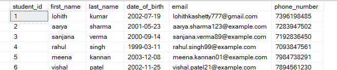

# Courses

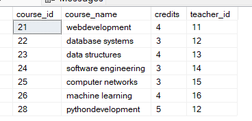

# Enrollments

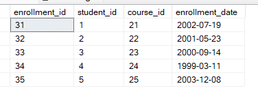

# Teachers

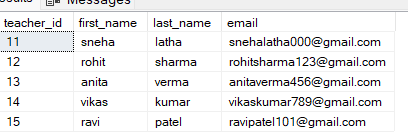

# Payments

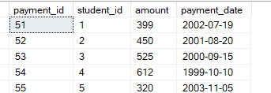

1. Write an SQL query to insert a new student named John Doe into the "Students" table.

```sql
insert into students values (7,'John','Doe','2003-09-12','johndoe@gmail.com','3456789012');
select*from students;
```

- output:
  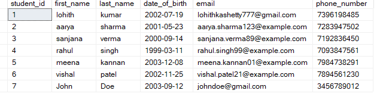

2. Write an SQL query to enroll an existing student in a course, specifying the enrollment date.

```sql
insert into enrollments values (36,1,21,'2025-09-13');
select * from enrollments;
```

- output
  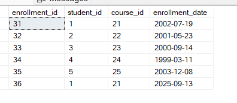

3. Update the email address of a teacher in the "Teachers" table.

```sql
update teachers
set email = 'lathasenha999@gmail.com'
where teacher_id = 41;

select*from teachers;
```

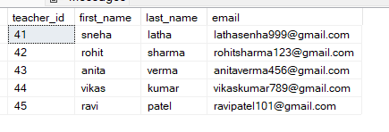

4. Write an SQL query to delete a specific enrollment record, choosing based on the student and course

```sql
delete from enrollments
where student_id=1 AND course_id=21;

select* from enrollments;
```

- output
  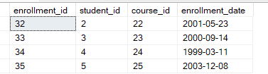

5. Update a course to assign a specific teacher using the "Courses" table.

```sql
update courses
set teacher_id = 17
where course_id = 21;

select * from courses;
```

- output
  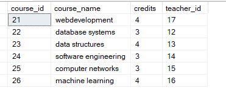

6. Write an SQL query to calculate the total payments made by a specific student.

```sql
select sum(amount) as total ,student_id
from payments
group by(student_id);
```

- output

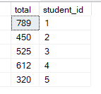

7. Retrieve a list of courses along with the count of students enrolled in each.

```sql
select courses.course_id,course_name, count(student_id) as noof_students_enrolled_in_course from courses
left join enrollments
on enrollments.course_id = courses.course_id
group by courses.course_id,courses.course_name;
```

- output

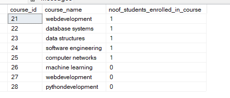

8. Find the names of students who have not enrolled in any course.

```sql
SELECT s.first_name, s.last_name
FROM Students s
LEFT JOIN Enrollments e ON s.student_id = e.student_id
WHERE e.student_id IS NULL;
```

- output


9. Retrieve the first name and last name of students, along with the names of the courses they are enrolled in.

```sql
select s.first_name, s.last_name , c.course_name from students s
join enrollments e on s.student_id = e.student_id
join courses c on c.course_id = e.course_id;
```

- output

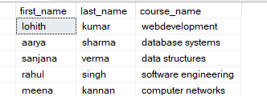

10. List names of teachers and the courses they are assigned to.

```sql
select t.first_name , t.last_name , c.course_name from teachers t
join courses c
on t.teacher_id = c.teacher_id;
```

- output


11. Calculate the average number of students enrolled in each course using aggregate functions and subqueries.

```sql
SELECT AVG(student_count) AS average_students_per_course
FROM (
    SELECT course_id, COUNT(student_id) AS student_count
    FROM Enrollments
    GROUP BY course_id
) As course_;
```

- output

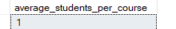

12. Identify the student(s) who made the highest payment using a subquery.

```sql
SELECT student_id, amount
FROM Payments
WHERE amount = (SELECT MAX(amount) FROM Payments);
```

- output

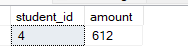

13. Retrieve a list of courses with the highest number of enrollments using subqueries.

```sql
SELECT TOP 1 course_name, COUNT(enrollment_id) AS num_enrollments
FROM enrollments
JOIN courses ON enrollments.course_id = courses.course_id
GROUP BY course_name
ORDER BY num_enrollments DESC;
```

- output

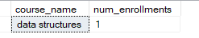

14. Calculate the total payments made to courses taught by each teacher using subqueries.

```sql
SELECT
    t.first_name,
    t.last_name,
    SUM(p.amount) AS total_payments
FROM
    payments p
JOIN
    enrollments e ON p.student_id = e.student_id
JOIN
    courses c ON e.course_id = c.course_id
JOIN
    teachers t ON c.teacher_id = t.teacher_id
GROUP BY
    t.first_name,
    t.last_name
ORDER BY
    total_payments DESC;
```

- output

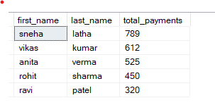

15. Identify students who are enrolled in more than one course.

```sql
SELECT student_id, COUNT(DISTINCT course_id) AS num_courses
FROM enrollments
GROUP BY student_id
HAVING COUNT(DISTINCT course_id) > 1
ORDER BY num_courses DESC;
```

- output


